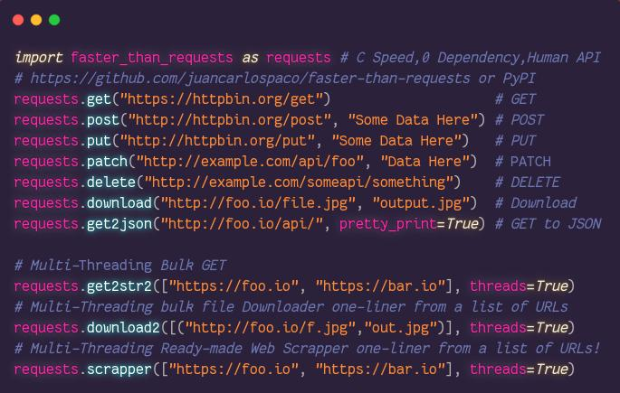

<meta name='keywords' content='python, requests, faster, speed, benchmark, pycurl, wget, urllib, rapido, velocidad, optimizacion, cython, pypy, urllib3, urllib2, urllib4, urllib5, urllib6, urllib7, urllib8, urllib9, pywget, cpython, http, httpclient, curl, libcurl, ssl, docker, json, ndjson, https, rapido, veloz, performance, critical, compiled, module, modulo, loc, minimalismo, minimalism, simple, small, tiny, argentina, spanish, compare, mejora, scraper, scrapy, data science, open data, open api'>


# Faster-than-Requests

[](https://youtu.be/QiKwnlyhKrk?t=5)




| Library                       | Speed    | Files | LOC  | Dependencies          | Developers | Multi-Threaded Web Scrapper Built-in |
|-------------------------------|----------|-------|------|-----------------------|------------|-----------------------------|
| PyWGET                        | `152.39` | 1     | 338  | Wget                  | >17        | No                          |
| Requests                      | `15.58`  | >20   | 2558 | >=7                   | >527       | No                          |
| Requests (cached object)      |  `5.50`  | >20   | 2558 | >=7                   | >527       | No                          |
| Urllib                        |  `4.00`  | ???   | 1200 | 0 (std lib)           | ???        | No                          |
| Urllib3                       |  `3.55`  | >40   | 5242 | 0 (No SSL), >=5 (SSL) | >188       | No                          |
| PyCurl                        |  `0.75`  | >15   | 5932 | Curl, LibCurl         | >50        | No                          |
| PyCurl (no SSL)               |  `0.68`  | >15   | 5932 | Curl, LibCurl         | >50        | No                          |
| Faster_than_requests          |  `0.45`  | 1     | 99   | 0                     | 1          | Yes, 2, [One-Liner](https://github.com/juancarlospaco/faster-than-requests/blob/master/examples/multithread_web_scrapper.py#L2) |

<details>

- Lines Of Code counted using [CLOC](https://github.com/AlDanial/cloc).
- Direct dependencies of the package when ready to run.
- Benchmarks run on Docker from Dockerfile on this repo.
- Developers counted from the Contributors list of Git.
- Speed is IRL time to complete 10000 HTTP local requests.
- Stats as of year 2019.
- x86_64 64Bit AMD, SSD, Arch Linux.

</details>


# Use

```python
import faster_than_requests as requests

requests.get("http://httpbin.org/get")                              # GET
requests.post("http://httpbin.org/post", "Some Data Here")          # POST
requests.download("http://example.com/foo.jpg", "out.jpg")          # Download a file
requests.scrapper(["http://foo.io", "http://bar.io"], threads=True) # Multi-Threaded Web Scrapper
```


# get()
<details>

**Description:**
Takes an URL string, makes an HTTP GET and returns a dict with the response.

**Arguments:**
- `url` the remote URL, string type, required, must not be empty string.

Examples:

```python
import faster_than_requests as requests
requests.get("http://example.com")
```

**Returns:**
Response, `dict` type, values of the dict are string type,
values of the dict can be empty string, but keys are always consistent.

</details>


# post()
<details>

**Description:**
Takes an URL string, makes an HTTP POST and returns a dict with the response.

**Arguments:**
- `url` the remote URL, string type, required, must not be empty string.
- `body` the Body data, string type, required, can be empty string.

Examples:

```python
import faster_than_requests as requests
requests.post("http://httpbin.org/post", "Some Data Here")
```

**Returns:**
Response, `dict` type, values of the dict are string type,
values of the dict can be empty string, but keys are always consistent.

</details>


# put()
<details>

**Description:**
Takes an URL string, makes an HTTP PUT and returns a dict with the response.

**Arguments:**
- `url` the remote URL, string type, required, must not be empty string.
- `body` the Body data, string type, required, can be empty string.

Examples:

```python
import faster_than_requests as requests
requests.put("http://httpbin.org/post", "Some Data Here")
```

**Returns:**
Response, `dict` type, values of the dict are string type,
values of the dict can be empty string, but keys are always consistent.

</details>


# delete()
<details>

**Description:**
Takes an URL string, makes an HTTP DELETE and returns a dict with the response.

**Arguments:**
- `url` the remote URL, string type, required, must not be empty string.

Examples:

```python
import faster_than_requests as requests
requests.delete("http://example.com/api/something")
```

**Returns:**
Response, `dict` type, values of the dict are string type,
values of the dict can be empty string, but keys are always consistent.

</details>


# patch()
<details>

**Description:**
Takes an URL string, makes an HTTP PATCH and returns a dict with the response.

**Arguments:**
- `url` the remote URL, string type, required, must not be empty string.
- `body` the Body data, string type, required, can be empty string.

Examples:

```python
import faster_than_requests as requests
requests.patch("http://example.com", "My Body Data Here")
```

**Returns:**
Response, `dict` type, values of the dict are string type,
values of the dict can be empty string, but keys are always consistent.

</details>


# Extras: Go beyond requests


# get2str()
<details>

**Description:**
Takes an URL string, makes an HTTP GET and returns a string with the response Body.

**Arguments:**
- `url` the remote URL, string type, required, must not be empty string.

Examples:

```python
import faster_than_requests as requests
requests.get2str("http://example.com")
```

**Returns:** Response body, `string` type, can be empty string.

</details>


# get2str2()
<details>

**Description:**
Takes a list of URLs, makes 1 HTTP GET for each URL, and returns a list of strings with the response Body.

**Arguments:**
- `list_of_urls` A list of the remote URLs, list type, required. Objects inside the list must be string type.
- `threads` Passing `threads = True` uses Multi-Threading, `threads = False` will Not use Multi-Threading, omitting it will Not use Multi-Threading.

Examples:

```python
import faster_than_requests as requests
requests.get2str2(["http://example.com/foo", "http://example.com/bar"], threads = True)
```

**Returns:**
List of response bodies, `list` type, values of the list are string type,
values of the list can be empty string, can be empty list.

</details>


# get2ndjson()
<details>

**Description:**
Takes a list of URLs, makes 1 HTTP GET for each URL, returns a list of strings with the response, and writes the responses to a NDJSON file, it can accumulate several JSON responses into a single file.

**Arguments:**
- `list_of_urls` A list of the remote URLs, list type, required. Objects inside the list must be string type.
- `ndjson_file_path` Full path to a local writable NDJSON file, string type, required, file can be non-existent and it will be created, if it exists it will the overwritten.

Examples:

```python
import faster_than_requests as requests
requests.get2ndjson(["http://example.com/foo", "http://example.com/bar"], "/some/folder/some/file.ndjson")
```

**Returns:** None.

</details>


# get2dict()
<details>

**Description:**
Takes an URL, makes an HTTP GET, returns a dict with the response Body.

**Arguments:**
- `url` the remote URL, string type, required, must not be empty string.

Examples:

```python
import faster_than_requests as requests
requests.get2dict("http://example.com")
```

**Returns:**
Response, `dict` type, values of the dict are string type,
values of the dict can be empty string, but keys are always consistent.

</details>


# get2json()
<details>

**Description:**
Takes an URL, makes an HTTP GET, returns a Minified Computer-friendly single-line JSON with the response Body.

**Arguments:**
- `url` the remote URL, string type, required, must not be empty string.
- `pretty_print` Pretty Printed JSON, optional, defaults to `False`.

Examples:

```python
import faster_than_requests as requests
requests.get2json("http://example.com", pretty_print=True)
```

**Returns:** Response Body, Minified or Pretty-Printed JSON.

</details>


# scrapper()
<details>

**Description:**
Multi-Threaded Ready-Made URL-Deduplicating Web Scrapper from a list of URLs.

**Arguments:**
- `list_of_urls` List of URLs, URL must be string type, required, must not be empty list.
- `html_tag` HTML Tag to parse, string type, optional, defaults to `"a"` being Links.
- `case_insensitive` Case Insensitive, `True` for Case Insensitive, optional, defaults to `True`.
- `deduplicate_urls` Deduplicate `list_of_urls` removing repeated URLs, optional, defaults to `False`.
- `threads` Passing `threads = True` uses Multi-Threading, `threads = False` will Not use Multi-Threading, omitting it will Not use Multi-Threading.

Examples:

```python
import faster_than_requests as requests
requestsscrapper(["https://nim-lang.org", "http://example.com"], case_insensitive=False, threads=True)
```

**Returns:** Scrapped Webs.

</details>


# scrapper2()
<details>

**Description:**
Multi-Tag Ready-Made URL-Deduplicating Web Scrapper from a list of URLs.

**Arguments:**
- `list_of_urls` List of URLs, URL must be string type, required, must not be empty list.
- `list_of_tags` List of HTML Tags to parse, List type, optional, defaults to `["a"]` being Links.
- `case_insensitive` Case Insensitive, `True` for Case Insensitive, optional, defaults to `True`.
- `deduplicate_urls` Deduplicate `list_of_urls` removing repeated URLs, optional, defaults to `False`.

Examples:

```python
import faster_than_requests as requests
requests.scrapper2(["https://nim-lang.org", "http://example.com"], list_of_tags=["h1", "h2"], case_insensitive=False)
```

**Returns:** Scrapped Webs.

</details>


# get2assert()
<details>

**Description:**
Takes an URL, makes an HTTP GET, returns nothing, makes an assertion, useful for Unittest and Debug purposes.

**Arguments:**
- `url` the remote URL, string type, required, must not be empty string.
- `expected` Response expected content, string type, required, can be empty string.

Examples:

```python
import faster_than_requests as requests
requests.get2assert("http://example.com/api/returns_int", "42")
```

**Returns:** None.

</details>


# post2str()
<details>

**Description:**
Takes an URL, makes an HTTP POST, returns the response Body as string type.

**Arguments:**
- `url` the remote URL, string type, required, must not be empty string.
- `body` the Body data, string type, required, can be empty string.

Examples:

```python
import faster_than_requests as requests
requests.post2str("http://example.com/api/foo", "My Body Data Here")
```

**Returns:** Response body, `string` type, can be empty string.

</details>


# post2dict()
<details>

**Description:**
Takes an URL, makes a HTTP POST on that URL, returns a dict with the response.

**Arguments:**
- `url` the remote URL, string type, required, must not be empty string.
- `body` the Body data, string type, required, can be empty string.

Examples:

```python
import faster_than_requests as requests
requests.post2dict("http://example.com/api/foo", "My Body Data Here")
```

**Returns:**
Response, `dict` type, values of the dict are string type,
values of the dict can be empty string, but keys are always consistent.

</details>


# post2json()
<details>

**Description:**
Takes a list of URLs, makes 1 HTTP GET for each URL, returns a list of responses.

**Arguments:**
- `url` the remote URL, string type, required, must not be empty string.
- `body` the Body data, string type, required, can be empty string.
- `pretty_print` Pretty Printed JSON, optional, defaults to `False`.

Examples:

```python
import faster_than_requests as requests
requests.post2json("http://example.com/api/foo", "My Body Data Here")
```

**Returns:** Response, string type.

</details>


# post2assert()
<details>

**Description:**
Takes an URL, makes an HTTP POST on that URL, returns a response.

**Arguments:**
- `url` the remote URL, string type, required, must not be empty string.
- `body` the Body data, string type, required, can be empty string.
- `expected` Response expected content, string type, required, can be empty string.

Examples:

```python
import faster_than_requests as requests
requests.post2assert("http://example.com/api/foo", "My Body Data Here")
```

**Returns:** None.

</details>


# post2list()
<details>

**Description:**
Takes a list of URLs, makes 1 HTTP POST for each URL, returns a list of responses.

**Arguments:**
- `list_of_urls` the remote URLS, list type, required, the objects inside the list must be string type.
- `body` the Body data, string type, required, can be empty string.

Examples:

```python
import faster_than_requests as requests
requests.post2list("http://example.com/api/foo", "My Body Data Here")
```

**Returns:**
List of response bodies, `list` type, values of the list are string type,
values of the list can be empty string, can be empty list.

</details>


# download()
<details>

**Description:**
Takes a list of URLs, makes 1 HTTP GET for each URL, returns a list of responses.

**Arguments:**
- `url` the remote URL, string type, required, must not be empty string.
- `filename` the local filename, string type, required, must not be empty string, full path recommended, can be relative path, includes file extension.

Examples:

```python
import faster_than_requests as requests
requests.download("http://example.com/api/foo", "my_file.ext")
```

**Returns:** None.

</details>


# download2()
<details>

**Description:**
Takes a list of URLs, makes 1 HTTP GET Download for each URL of the list.

**Arguments:**
- `list_of_files` list of tuples, tuples must be 2 items long, first item is URL and second item is filename.
The remote URL, string type, required, must not be empty string, is the first item on the tuple.
The local filename, string type, required, must not be empty string, can be full path, can be relative path, must include file extension.
- `delay` Delay between a download and the next one, MicroSeconds precision (1000 = 1 Second), integer type, optional, defaults to `0`, must be a positive integer value.
- `threads` Passing `threads = True` uses Multi-Threading, `threads = False` will Not use Multi-Threading, omitting it will Not use Multi-Threading.

Examples:

```python
import faster_than_requests as requests
requests.download2([("http://example.com/cat.jpg", "kitten.jpg"), ("http://example.com/dog.jpg", "doge.jpg")])
```

**Returns:** None.

</details>


# set_headers()
<details>

**Description:**
Set the HTTP Headers from the arguments.

**Arguments:**
- `headers` HTTP Headers, list type, required,
a list of tuples, tuples must be 2 items long,
must not be empty list, must not be empty tuple,
the first item of the tuple is the key and second item of the tuple is value,
keys must not be empty string, values can be empty string, both must the stripped.

Examples:

```python
import faster_than_requests as requests
requests.set_headers(headers = [("key", "value")])
```

```python
import faster_than_requests as requests
requests.set_headers([("key0", "value0"), ("key1", "value1")])
```

```python
import faster_than_requests as requests
requests.set_headers([("content-type", "text/plain"), ("dnt", "1")])
```

**Returns:** None.

</details>


# requests()
<details>

**Description:**
Low level API of Requests with everything available as argument to build a detailed custom HTTP request.

**Arguments:**
- `url` the remote URL, string type, required, must not be empty string.
- `body` the Body data, string type, required, can be empty string.
- `http_method` HTTP method, string type, required, must not be empty string, values can be `"GET"`, `"POST"`, etc.
- `debugs` Debug mode, bool type, required, default is `False`.
- `http_headers` HTTP Headers, list type, required,
a list of tuples, tuples must be 2 items long,
must not be empty list, must not be empty tuple,
the first item of the tuple is the key and second item of the tuple is value,
keys must not be empty string, values can be empty string, both must the stripped.

**Returns:**
Response, `dict` type, values of the dict are string type,
values of the dict can be empty string, but keys are always consistent.

</details>


# requests2()
<details>

**Description:**
Low level API of Requests with everything available as argument with extra options to build a detailed custom HTTP request.
Its like `request()` function but re-imagined with different features.
May be slower than `request()`.

**Arguments:**
- `url` Remote URL, string type, required, must not be empty string.
- `body` the Body data, string type, required, can be empty string.
- `proxyUrl` Full URL of your Network Proxy, string type, required, can be empty string.
- `proxyAuth` Auth of your Network Proxy if any, string type, required, can be empty string.
- `userAgent` User Agent to use for the requests, string type, required, can be empty string.
- `timeout` Timeout, integer type, Milliseconds precision, must be non-zero positive integer, can be `-1`.
- `maxRedirects` Maximum Redirects, integer type, must be non-zero positive integer, can be `1`.
- `http_method` HTTP method, string type, required, must not be empty string, values can be `"GET"`, `"POST"`, etc.
- `http_headers` HTTP Headers, list type, required,
a list of tuples, tuples must be 2 items long,
must not be empty list, must not be empty tuple,
the first item of the tuple is the key and second item of the tuple is value,
keys must not be empty string, values can be empty string, both must the stripped.

**Returns:**
Response, `dict` type, values of the dict are string type,
values of the dict can be empty string, but keys are always consistent.

</details>


# debugs()
<details>

**Description:**
Debug the internal Configuration of the library, takes no arguments, returns nothing,
prints the pretty-printed human-friendly multi-line JSON Configuration to standard output terminal.


Examples:

```python
import faster_than_requests as requests
requests.debugs()
```

**Arguments:** None.

**Returns:** None.

</details>


# tuples2json()
<details>

**Description:**
Convert Tuples to JSON, this is a UX improvement just for convenience, this is 100% optional,
returns the Tuples converted to Minified computer-friendly single-line JSON.

**Arguments:**
- `tuples` A list containing Tuples, list type, required,
a list of tuples, tuples must be 2 items long,
must not be empty list, must not be empty tuple,
the first item of the tuple is the key and second item of the tuple is value,
keys must not be empty string, values can be empty string, both must the stripped.

**Returns:** JSON, string type.

</details>


[**For more Examples check the Examples and Tests.**](https://github.com/juancarlospaco/faster-than-requests/blob/master/examples/example.py)

Instead of having a pair of functions with a lot of arguments that you should provide to make it work,
we have tiny functions with very few arguments that do one thing and do it as fast as possible.

A lot of functions are oriented to Data Science, Big Data, Open Data, Web Scrapping, working with HTTP REST JSON APIs.


# Install

- `pip install faster_than_requests`


# Docker

- Make a quick test drive on Docker!.

```bash
$ ./build-docker.sh
$ ./run-docker.sh
$ ./server4benchmarks &  # Inside Docker.
$ python3 benchmark.py   # Inside Docker.
```


# Dependencies

- **None**


# Platforms

- ✅ Linux
- ✅ Windows
- ✅ Mac
- ✅ Android
- ✅ Raspberry Pi
- ✅ BSD


# Extras

More Faster Libraries...

- https://github.com/juancarlospaco/faster-than-csv#faster-than-csv
- https://github.com/juancarlospaco/faster-than-walk#faster-than-walk
- We want to make Open Source faster, better, stronger.


# Requisites

- Python 3.
- GCC.
- 64 Bit.


##### Low Level API Extras

To control the default values the following optional Bash environment variables are available:

- `requests_timeout` Timeout, `int` type, must be a non-zero positive value, milliseconds precision, can be `-1`.
- `requests_maxredirects` Maximum Redirects, `int` type, must be a zero or positive value, can be `1`, can be `0`.
- `requests_useragent` User Agent, `str` type, can be empty string, recommended empty string, can be `""`.

Examples:

```bash
$ export https_proxy = "http://yourProxyUrl:8080"
$ export requests_maxredirects = "42"
$ # This is the Bash command line terminal!.
```

- **This is 100% Optional. This is provided as Extra features.**


# Windows

- If installation fails on Windows, just use the Source Code:


- Git Clone and Compile on Windows 10 on just 2 commands!.
- [Alternatively you can try Docker for Windows.](https://docs.docker.com/docker-for-windows)
- **The file extension must be `.pyd`, NOT `.dll`. Compile with `-d:ssl` to use HTTPS.**


# Stars


# FAQ

- Whats the idea, inspiration, reason, etc ?.

[Feel free to Fork, Clone, Download, Improve, Reimplement, Play with this Open Source. Make it 10 times faster, 10 times smaller.](http://tonsky.me/blog/disenchantment)

- This works with SSL ?.

Yes.

- This works without SSL ?.

Yes.

- This requires Cython ?.

No.

- This runs on PyPy ?.

No.

- This runs on Python2 ?.

I dunno. (Not supported)

- This runs on 32Bit ?.

No.

- This runs with Clang ?.

No.

- How can I Install it ?.

`pip install faster_than_requests`

- Developer Documentation ?.

[Yes.](https://github.com/juancarlospaco/faster-than-requests/raw/master/faster_than_requests_DOCS.zip)
(Zip because GitHub marks the Repo as being JavaScript)

- Where to get help ?.

https://github.com/juancarlospaco/faster-than-requests/issues

- How to set the URL ?.

`url="http://example.com"` (1st argument always).

- How to set the HTTP Method ?.

`http_method="get"` for GET.

`http_method="post"` for POST.

`http_method="put"` for PUT.

`http_method="patch"` for PATCH.

- How to set the HTTP Body ?.

`body="my body"`

- How to set an HTTP Header key=value ?.

[setHeaders()](https://github.com/juancarlospaco/faster-than-requests#setheaders)

- How to set HTTP Proxy ?.

[requests2()](https://github.com/juancarlospaco/faster-than-requests#requests2)

OR

`export https_proxy = "http://yourProxyUrl:8080"`

`export http_proxy =  "http://yourProxyUrl:8080"`

Standard Linux Bash environment variables for proxy.

It will be automatically read from the environment variables.

- Whats NDJSON ?.

https://github.com/ndjson/ndjson-spec

- How can be faster than PyCurl ?.

I dunno.

- Why use Tuple instead of Dict for HTTP Headers ?.

For speed performance reasons, `dict` is slower, bigger, heavier and mutable compared to `tuple`.

- Why needs 64Bit ?.

Maybe it works on 32Bit, but is not supported, integer sizes are too small, and performance can be worse.

- Why needs Python 3 ?.

Maybe it works on Python 2, but is not supported, and performance can be worse, we suggest to migrate to Python3.

- Can I wrap the functions on a `try: except:` block ?.

Functions do not have internal `try: except:` blocks,
so you can wrap them inside `try: except:` blocks if you need very resilient code.

- PIP fails to install or fails build the wheel ?.

Add at the end of the PIP install command:

` --isolated --disable-pip-version-check --no-cache-dir --no-binary :all: `

Not my Bug.

- How to Build the project ?.

`build.sh`

- How to Package the project ?.

`package.sh`

- This requires Nimble ?.

No.

- Whats the unit of measurement for speed ?.

Unmmodified raw output of Python `timeit` module.

Please send Pull Request to Python to improve the output of `timeit`.

- The LoC is a lie, not counting the lines of code of the Compiler ?.

Projects that use Cython wont count the whole Cython on the LoC, so we wont neither.


[  ⬆️  ⬆️  ⬆️  ⬆️  ](#faster-than-requests "Go to top")
