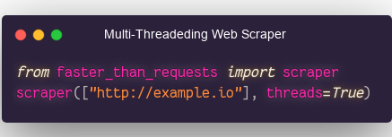
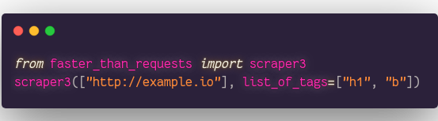
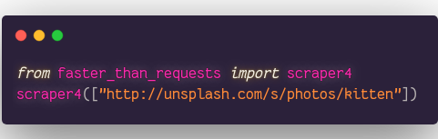
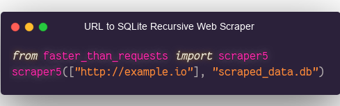

<meta name='keywords' content='python, requests, faster, speed, benchmark, pycurl, wget, urllib, rapido, velocidad, optimizacion, cython, pypy, urllib3, urllib2, urllib4, urllib5, urllib6, urllib7, urllib8, urllib9, pywget, cpython, http, httpclient, curl, libcurl, ssl, docker, json, ndjson, https, rapido, veloz, performance, critical, compiled, module, modulo, loc, minimalismo, minimalism, simple, small, tiny, argentina, spanish, compare, mejora, scraper, scrapy, data science, open data, open api'>


# Faster-than-Requests

[](https://youtu.be/QiKwnlyhKrk?t=5)


| Library                       | Speed    | Files | LOC  | Dependencies          | Developers | Multi-Threaded Web Scraper Built-in |
|-------------------------------|----------|-------|------|-----------------------|------------|-------------------------------------|
| PyWGET                        | `152.39` | 1     | 338  | Wget                  | >17        | :negative_squared_cross_mark:       |
| Requests                      | `15.58`  | >20   | 2558 | >=7                   | >527       | :negative_squared_cross_mark:       |
| Requests (cached object)      |  `5.50`  | >20   | 2558 | >=7                   | >527       | :negative_squared_cross_mark:       |
| Urllib                        |  `4.00`  | ???   | 1200 | 0 (std lib)           | ???        | :negative_squared_cross_mark:       |
| Urllib3                       |  `3.55`  | >40   | 5242 | 0 (No SSL), >=5 (SSL) | >188       | :negative_squared_cross_mark:       |
| PyCurl                        |  `0.75`  | >15   | 5932 | Curl, LibCurl         | >50        | :negative_squared_cross_mark:       |
| PyCurl (no SSL)               |  `0.68`  | >15   | 5932 | Curl, LibCurl         | >50        | :negative_squared_cross_mark:       |
| Faster_than_requests          |  `0.45`  | 1     | 99   | 0                     | 1          | :heavy_check_mark: 6, [One-Liner](https://github.com/juancarlospaco/faster-than-requests/blob/master/examples/multithread_web_scraper.py#L2) |

<details>

- Lines Of Code counted using [CLOC](https://github.com/AlDanial/cloc).
- Direct dependencies of the package when ready to run.
- Benchmarks run on Docker from Dockerfile on this repo.
- Developers counted from the Contributors list of Git.
- Speed is IRL time to complete 10000 HTTP local requests.
- Stats as of year 2019.
- x86_64 64Bit AMD, SSD, Arch Linux.

</details>


# Use

```python
import faster_than_requests as requests

requests.get("http://httpbin.org/get")                             # GET
requests.post("http://httpbin.org/post", "Some Data Here")         # POST
requests.download("http://example.com/foo.jpg", "out.jpg")         # Download a file
requests.scraper(["http://foo.io", "http://bar.io"], threads=True) # Multi-Threaded Web Scraper
```

# Table Of Contents

|                         |                             |                               |                           |
|:-----------------------:|:---------------------------:|:-----------------------------:|:-------------------------:|
| [get()](#get)           | [post()](#post)             | [put()](#put)                 | [head()](#head)           |
| [patch()](#patch)       | [delete()](#delete)         | [download()](#download)       | [download2()](#download2) |
| [scraper()](#scraper)   | [scraper2()](#scraper2)     | [scraper3()](#scraper3)       | [scraper4()](#scraper4)   |
| [scraper5()](#scraper5) | [scraper6()](#scraper6)     | [debugs()](#debugs)           | [get2str()](#get2str)     |
| [get2str2()](#get2str2) | [get2ndjson()](#get2ndjson) | [get2dict()](#get2dict)       | [get2json()](#get2json)   |
| [post2str()](#post2str) | [post2dict()](#post2dict)   | [post2json()](#post2json)     | [post2list()](#post2list) |
| [requests()](#requests) | [requests2()](#requests2)   | [tuples2json()](#tuples2json) | [set_headers()](#set_headers) |
| [How to set Timeout](#How-to-set-Timeout) | [How to set Max Redirects](#How-to-set-Max-Redirects) | [How to set User Agent](#How-to-set-User-Agent) | [How to set Proxy](#How-to-set-Proxy) |
| [How to Install](#install) | [How to Windows](#windows) | [FAQ](#faq) | [Get Help](https://github.com/juancarlospaco/faster-than-requests/issues/new/choose) |
| [PyPI](https://pypi.org/project/faster-than-requests) | [GitHub Actions](https://github.com/juancarlospaco/faster-than-requests/actions?query=workflow%3APYTHON) | [Examples](https://github.com/juancarlospaco/faster-than-requests/tree/master/examples) | [Sponsors](#sponsors) |


# get()
<details>

**Description:**
Takes an URL string, makes an HTTP GET and returns a dict with the response.

**Arguments:**
- `url` the remote URL, string type, required, must not be empty string, example `https://dev.to`.

Examples:

```python
import faster_than_requests as requests
requests.get("http://example.com")
```

**Returns:**
Response, `dict` type, values of the dict are string type,
values of the dict can be empty string, but keys are always consistent.

**See Also:**
[get2str()](https://github.com/juancarlospaco/faster-than-requests#get2str) and [get2str2()](https://github.com/juancarlospaco/faster-than-requests#get2str2)

</details>


# post()
<details>

**Description:**
Takes an URL string, makes an HTTP POST and returns a dict with the response.

**Arguments:**
- `url` the remote URL, string type, required, must not be empty string, example `https://dev.to`.
- `body` the Body data, string type, required, can be empty string.
- `multipart_data` MultiPart data, optional, list of tupes type, must not be empty list, example `[("key", "value")]`.

Examples:

```python
import faster_than_requests as requests
requests.post("http://httpbin.org/post", "Some Data Here")
```

**Returns:**
Response, `dict` type, values of the dict are string type,
values of the dict can be empty string, but keys are always consistent.

</details>


# put()
<details>

**Description:**
Takes an URL string, makes an HTTP PUT and returns a dict with the response.

**Arguments:**
- `url` the remote URL, string type, required, must not be empty string, example `https://nim-lang.org`.
- `body` the Body data, string type, required, can be empty string.

Examples:

```python
import faster_than_requests as requests
requests.put("http://httpbin.org/post", "Some Data Here")
```

**Returns:**
Response, `dict` type, values of the dict are string type,
values of the dict can be empty string, but keys are always consistent.

</details>


# delete()
<details>

**Description:**
Takes an URL string, makes an HTTP DELETE and returns a dict with the response.

**Arguments:**
- `url` the remote URL, string type, required, must not be empty string, example `https://nim-lang.org`.

Examples:

```python
import faster_than_requests as requests
requests.delete("http://example.com/api/something")
```

**Returns:**
Response, `dict` type, values of the dict are string type,
values of the dict can be empty string, but keys are always consistent.

</details>


# patch()
<details>

**Description:**
Takes an URL string, makes an HTTP PATCH and returns a dict with the response.

**Arguments:**
- `url` the remote URL, string type, required, must not be empty string, example `https://archlinux.org`.
- `body` the Body data, string type, required, can be empty string.

Examples:

```python
import faster_than_requests as requests
requests.patch("http://example.com", "My Body Data Here")
```

**Returns:**
Response, `dict` type, values of the dict are string type,
values of the dict can be empty string, but keys are always consistent.

</details>


# head()
<details>

**Description:**
Takes an URL string, makes an HTTP HEAD and returns a dict with the response.

**Arguments:**
- `url` the remote URL, string type, required, must not be empty string, example `https://nim-lang.org`.

Examples:

```python
import faster_than_requests as requests
requests.head("http://example.com/api/something")
```

**Returns:**
Response, `dict` type, values of the dict are string type,
values of the dict can be empty string, but keys are always consistent.

</details>


# Extras: Go beyond requests

## scraper()
<details>

**Description:**
Multi-Threaded Ready-Made URL-Deduplicating Web Scraper from a list of URLs.



All arguments are optional, it only needs the URL to get to work.
Scraper is designed to be like a 2-Step Web Scraper, that makes a first pass collecting all URL Links and then a second pass actually fetching those URLs.
Requests are processed asynchronously. This means that it doesn’t need to wait for a request to be finished to be processed.

**Arguments:**
- `list_of_urls` List of URLs, URL must be string type, required, must not be empty list, example `["http://example.io"]`.
- `html_tag` HTML Tag to parse, string type, optional, defaults to `"a"` being Links, example `"h1"`.
- `case_insensitive` Case Insensitive, `True` for Case Insensitive, boolean type, optional, defaults to `True`, example `True`.
- `deduplicate_urls` Deduplicate `list_of_urls` removing repeated URLs, boolean type, optional, defaults to `False`, example `False`.
- `threads` Passing `threads = True` uses Multi-Threading, `threads = False` will Not use Multi-Threading, boolean type, optional, omitting it will Not use Multi-Threading.

Examples:

```python
import faster_than_requests as requests
requests.scraper(["https://nim-lang.org", "http://example.com"], threads=True)
```

**Returns:** Scraped Webs.

</details>


## scraper2()
<details>

**Description:**
Multi-Tag Ready-Made URL-Deduplicating Web Scraper from a list of URLs.
All arguments are optional, it only needs the URL to get to work.
Scraper is designed to be like a 2-Step Web Scraper, that makes a first pass collecting all URL Links and then a second pass actually fetching those URLs.
Requests are processed asynchronously. This means that it doesn’t need to wait for a request to be finished to be processed.
You can think of this scraper as a parallel evolution of the original scraper.

**Arguments:**
- `list_of_urls` List of URLs, URL must be string type, required, must not be empty list, example `["http://example.io"]`.
- `list_of_tags` List of HTML Tags to parse, List type, optional, defaults to `["a"]` being Links, example `["h1", "h2"]`.
- `case_insensitive` Case Insensitive, `True` for Case Insensitive, boolean type, optional, defaults to `True`, example `True`.
- `deduplicate_urls` Deduplicate `list_of_urls` removing repeated URLs, boolean type, optional, defaults to `False`, example `False`.
- `verbose` Verbose, print to terminal console the progress, bool type, optional, defaults to `True`, example `False`.
- `delay` Delay between a download and the next one, MicroSeconds precision (1000 = 1 Second), integer type, optional, defaults to `0`, must be a positive integer value, example `42`.
- `threads` Passing `threads = True` uses Multi-Threading, `threads = False` will Not use Multi-Threading, boolean type, optional, omitting it will Not use Multi-Threading.
- `agent` User Agent, string type, optional, must not be empty string.
- `redirects` Maximum Redirects, integer type, optional, defaults to `5`, must be positive integer.
- `timeout` Timeout, MicroSeconds precision (1000 = 1 Second), integer type, optional, defaults to `-1`, must be a positive integer value, example `42`.
- `header` HTTP Header, any HTTP Headers can be put here, list type, optional, example `[("key", "value")]`.
- `proxy_url` HTTPS Proxy Full URL, string type, optional, must not be empty string.
- `proxy_auth` HTTPS Proxy Authentication, string type, optional, defaults to `""`, empty string is ignored.

Examples:

```python
import faster_than_requests as requests
requests.scraper2(["https://nim-lang.org", "http://example.com"], list_of_tags=["h1", "h2"], case_insensitive=False)
```

**Returns:** Scraped Webs.

</details>


## scraper3()
<details>

**Description:**
Multi-Tag Ready-Made URL-Deduplicating Web Scraper from a list of URLs.



This Scraper is designed with lots of extra options on the arguments.
All arguments are optional, it only needs the URL to get to work.
Scraper is designed to be like a 2-Step Web Scraper, that makes a first pass collecting all URL Links and then a second pass actually fetching those URLs.
You can think of this scraper as a parallel evolution of the original scraper.

**Arguments:**
- `list_of_urls` List of URLs, URL must be string type, required, must not be empty list, example `["http://example.io"]`.
- `list_of_tags` List of HTML Tags to parse, List type, optional, defaults to `["a"]` being Links, example `["h1", "h2"]`.
- `case_insensitive` Case Insensitive, `True` for Case Insensitive, boolean type, optional, defaults to `True`, example `True`.
- `deduplicate_urls` Deduplicate `list_of_urls` removing repeated URLs, boolean type, optional, defaults to `False`, example `False`.
- `start_with` Match at the start of the line, similar to `str().startswith()`, string type, optional, example `"<cite "`.
- `ends_with` Match at the end of the line, similar to `str().endswith()`,  string type, optional, example `"</cite>"`.
- `delay` Delay between a download and the next one, MicroSeconds precision (1000 = 1 Second), integer type, optional, defaults to `0`, must be a positive integer value, example `42`.
- `line_start` Slice the line at the start by this index, integer type, optional, defaults to `0` meaning no slicing since string start at index 0, example `3` cuts off 3 letters of the line at the start.
- `line_end` Slice the line at the end by this *reverse* index, integer type, optional, defaults to `1` meaning no slicing since string ends at reverse index 1, example `9` cuts off 9 letters of the line at the end.
- `pre_replacements` List of tuples of strings to replace *before* parsing, replacements are in parallel, List type, optional, example `[("old", "new"), ("red", "blue")]` will replace `"old"` with `"new"` and will replace `"red"` with `"blue"`.
- `post_replacements` List of tuples of strings to replace *after* parsing, replacements are in parallel, List type, optional, example `[("old", "new"), ("red", "blue")]` will replace `"old"` with `"new"` and will replace `"red"` with `"blue"`.
- `agent` User Agent, string type, optional, must not be empty string.
- `redirects` Maximum Redirects, integer type, optional, defaults to `5`, must be positive integer.
- `timeout` Timeout, MicroSeconds precision (1000 = 1 Second), integer type, optional, defaults to `-1`, must be a positive integer value, example `42`.
- `header` HTTP Header, any HTTP Headers can be put here, list type, optional, example `[("key", "value")]`.
- `proxy_url` HTTPS Proxy Full URL, string type, optional, must not be empty string.
- `proxy_auth` HTTPS Proxy Authentication, string type, optional, defaults to `""`, empty string is ignored.
- `verbose` Verbose, print to terminal console the progress, bool type, optional, defaults to `True`, example `False`.

Examples:

```python
import faster_than_requests as requests
requests.scraper3(["https://nim-lang.org", "http://example.com"], list_of_tags=["h1", "h2"], case_insensitive=False)
```

**Returns:** Scraped Webs.

</details>


## scraper4()
<details>

**Description:**
Images and Photos Ready-Made Web Scraper from a list of URLs.



The Images and Photos scraped from the first URL will be put into a new sub-folder named `0`,
Images and Photos scraped from the second URL will be put into a new sub-folder named `1`, and so on.
All arguments are optional, it only needs the URL to get to work.
You can think of this scraper as a parallel evolution of the original scraper.

**Arguments:**
- `list_of_urls` List of URLs, URL must be string type, required, must not be empty list, example `["https://unsplash.com/s/photos/cat", "https://unsplash.com/s/photos/dog"]`.
- `case_insensitive` Case Insensitive, `True` for Case Insensitive, boolean type, optional, defaults to `True`, example `True`.
- `deduplicate_urls` Deduplicate `list_of_urls` removing repeated URLs, boolean type, optional, defaults to `False`, example `False`.
- `visited_urls` Do not visit same URL twice, even if redirected into, keeps track of visited URLs, bool type, optional, defaults to `True`.
- `delay` Delay between a download and the next one, MicroSeconds precision (1000 = 1 Second), integer type, optional, defaults to `0`, must be a positive integer value, example `42`.
- `folder` Directory to download Images and Photos, string type, optional, defaults to current folder, must not be empty string, example `/tmp`.
- `force_extension` Force file extension to be this file extension, string type, optional, defaults to `".jpg"`, must not be empty string, example `".png"`.
- `https_only` Force to download images on Secure HTTPS only ignoring plain HTTP, sometimes HTTPS may redirect to HTTP, bool type, optional, defaults to `False`, example `True`.
- `html_output` Collect all scraped Images and Photos into 1 HTML file with all elements scraped, bool type, optional, defaults to `True`, example `False`.
- `csv_output` Collect all scraped URLs into 1 CSV file with all links scraped, bool type, optional, defaults to `True`, example `False`.
- `verbose` Verbose, print to terminal console the progress, bool type, optional, defaults to `True`, example `False`.
- `print_alt` print to terminal console the `alt` attribute of the Images and Photos, bool type, optional, defaults to `False`, example `True`.
- `picture` Scrap images from the new HTML5 `<picture>` tags instead of `` tags, `<picture>` are Responsive images for several resolutions but also you get duplicated images, bool type, optional, defaults to `False`, example `True`.
- `agent` User Agent, string type, optional, must not be empty string.
- `redirects` Maximum Redirects, integer type, optional, defaults to `5`, must be positive integer.
- `timeout` Timeout, MicroSeconds precision (1000 = 1 Second), integer type, optional, defaults to `-1`, must be a positive integer value, example `42`.
- `header` HTTP Header, any HTTP Headers can be put here, list type, optional, example `[("key", "value")]`.
- `proxy_url` HTTPS Proxy Full URL, string type, optional, must not be empty string.
- `proxy_auth` HTTPS Proxy Authentication, string type, optional, defaults to `""`, empty string is ignored.

Examples:

```python
import faster_than_requests as requests
requests.scraper4(["https://unsplash.com/s/photos/cat", "https://unsplash.com/s/photos/dog"])
```

**Returns:** None.

</details>


## scraper5()
<details>

**Description:**
Recursive Web Scraper to SQLite Database, you give it an URL, it gives back an SQLite.



SQLite database can be visualized with any SQLite WYSIWYG, like https://sqlitebrowser.org
If the script gets interrupted like with CTRL+C it will try its best to keep data consistent.
Additionally it will create a CSV file with all the scraped URLs.
HTTP Headers are stored as Pretty-Printed JSON.
Date and Time are stored as Unix Timestamps.
All arguments are optional, it only needs the URL and SQLite file path to get to work.
You can think of this scraper as a parallel evolution of the original scraper.

**Arguments:**
- `list_of_urls` List of URLs, URL must be string type, required, must not be empty list, example `["https://unsplash.com/s/photos/cat", "https://unsplash.com/s/photos/dog"]`.
- `sqlite_file_path` Full file path to a new SQLite Database, must be `.db` file extension, string type, required, must not be empty string, example `"scraped_data.db"`.
- `skip_ends_with` Skip the URL if ends with this pattern, list type, optional, must not be empty list, example `[".jpg", ".pdf"]`.
- `case_insensitive` Case Insensitive, `True` for Case Insensitive, boolean type, optional, defaults to `True`, example `True`.
- `deduplicate_urls` Deduplicate `list_of_urls` removing repeated URLs, boolean type, optional, defaults to `False`, example `False`.
- `visited_urls` Do not visit same URL twice, even if redirected into, keeps track of visited URLs, bool type, optional, defaults to `True`.
- `delay` Delay between a download and the next one, MicroSeconds precision (1000 = 1 Second), integer type, optional, defaults to `0`, must be a positive integer value, example `42`.
- `https_only` Force to download images on Secure HTTPS only ignoring plain HTTP, sometimes HTTPS may redirect to HTTP, bool type, optional, defaults to `False`, example `True`.
- `only200` Only commit to Database the successful scraping pages, ignore all errors, bool type, optional, example `True`.
- `agent` User Agent, string type, optional, must not be empty string.
- `redirects` Maximum Redirects, integer type, optional, defaults to `5`, must be positive integer.
- `timeout` Timeout, MicroSeconds precision (1000 = 1 Second), integer type, optional, defaults to `-1`, must be a positive integer value, example `42`.
- `max_loops` Maximum total Loops to do while scraping, like a global guard for infinite redirections, integer type, optional, example `999`.
- `max_deep` Maximum total scraping Recursive Deep, like a global guard for infinite deep recursivity, integer type, optional, example `999`.
- `header` HTTP Header, any HTTP Headers can be put here, list type, optional, example `[("key", "value")]`.
- `proxy_url` HTTPS Proxy Full URL, string type, optional, must not be empty string.
- `proxy_auth` HTTPS Proxy Authentication, string type, optional, defaults to `""`, empty string is ignored.

Examples:

```python
import faster_than_requests as requests
requests.scraper5(["https://example.com"], "scraped_data.db")
```

**Returns:** None.

</details>


## scraper6()
<details>

**Description:**
Regex powered Web Scraper from a list of URLs.
Scrap web content using a list of Perl Compatible Regular Expressions (PCRE standard).
You can configure the Regular Expressions to be case insensitive or multiline or extended.

This Scraper is designed for developers that know Regular Expressions.
[Learn Regular Expressions.](https://github.com/ziishaned/learn-regex#translations)

All arguments are optional, it only needs the URL and the Regex to get to work.
You can think of this scraper as a parallel evolution of the original scraper.

**Regex Arguments:**
(Arguments focused on Regular Expression parsing and matching)

- `list_of_regex` List of Perl Compatible Regular Expressions (PCRE standard) to match the URL against, List type, required, example `["(www|http:|https:)+[^\s]+[\w]"]`.
- `case_insensitive` Case Insensitive Regular Expressions, do caseless matching, `True` for Case Insensitive, boolean type, optional, defaults to `False`, example `True`.
- `multiline` Multi-Line Regular Expressions, `^` and `$` match newlines within data, boolean type, optional, defaults to `False`, example `True`.
- `extended` Extended Regular Expressions, ignore all whitespaces and `#` comments, boolean type, optional, defaults to `False`, example `True`.
- `dot` Dot `.` matches anything, including new lines, boolean type, optional, defaults to `False`, example `True`.
- `start_with` Perl Compatible Regular Expression to match at the start of the line, similar to `str().startswith()` but with Regular Expressions, string type, optional.
- `ends_with`  Perl Compatible Regular Expression to match at the end of the line,  similar to `str().endswith()` but with Regular Expressions, string type, optional.
- `post_replacement_regex` Perl Compatible Regular Expressions (PCRE standard) to replace *after* parsing, string type, optional, this option works with `post_replacement_by`, this is like a Regex post-processing, this option is for experts on Regular Expressions.
- `post_replacement_by` string **to replace by** *after* parsing, string type, optional, this option works with `post_replacement_regex`, this is like a Regex post-processing, this option is for experts on Regular Expressions.
- `re_start` Perl Compatible Regular Expression matchs start at this index, positive integer type, optional, defaults to `0`, this option is for experts on Regular Expressions.

**Arguments:**
- `list_of_urls` List of URLs, URL must be string type, required, must not be empty list, example `["http://example.io"]`.
- `deduplicate_urls` Deduplicate `list_of_urls` removing repeated URLs, boolean type, optional, defaults to `False`, example `False`.
- `delay` Delay between a download and the next one, MicroSeconds precision (1000 = 1 Second), integer type, optional, defaults to `0`, must be a positive integer value, example `42`.
- `agent` User Agent, string type, optional, must not be empty string.
- `redirects` Maximum Redirects, integer type, optional, defaults to `5`, must be positive integer.
- `timeout` Timeout, MicroSeconds precision (1000 = 1 Second), integer type, optional, defaults to `-1`, must be a positive integer value, example `42`.
- `header` HTTP Header, any HTTP Headers can be put here, list type, optional, example `[("key", "value")]`.
- `proxy_url` HTTPS Proxy Full URL, string type, optional, must not be empty string.
- `proxy_auth` HTTPS Proxy Authentication, string type, optional, defaults to `""`, empty string is ignored.
- `verbose` Verbose, print to terminal console the progress, bool type, optional, defaults to `True`, example `False`.

Examples:

```python
import faster_than_requests as requests
requests.scraper6(["http://nim-lang.org", "http://python.org"], ["(www|http:|https:)+[^\s]+[\w]"])
```

**Returns:** Scraped Webs.

</details>


## get2str()
<details>

**Description:**
Takes an URL string, makes an HTTP GET and returns a string with the response Body.

**Arguments:**
- `url` the remote URL, string type, required, must not be empty string, example `https://archlinux.org`.

Examples:

```python
import faster_than_requests as requests
requests.get2str("http://example.com")
```

**Returns:** Response body, `string` type, can be empty string.

</details>


## get2str2()
<details>

**Description:**
Takes a list of URLs, makes 1 HTTP GET for each URL, and returns a list of strings with the response Body.

**Arguments:**
- `list_of_urls` A list of the remote URLs, list type, required. Objects inside the list must be string type.
- `threads` Passing `threads = True` uses Multi-Threading, `threads = False` will Not use Multi-Threading, omitting it will Not use Multi-Threading.

Examples:

```python
import faster_than_requests as requests
requests.get2str2(["http://example.com/foo", "http://example.com/bar"], threads = True)
```

**Returns:**
List of response bodies, `list` type, values of the list are string type,
values of the list can be empty string, can be empty list.

</details>


## get2ndjson()
<details>

**Description:**
Takes a list of URLs, makes 1 HTTP GET for each URL, returns a list of strings with the response, and writes the responses to a NDJSON file, it can accumulate several JSON responses into a single file.

**Arguments:**
- `list_of_urls` A list of the remote URLs, list type, required. Objects inside the list must be string type.
- `ndjson_file_path` Full path to a local writable NDJSON file, string type, required, file can be non-existent and it will be created, if it exists it will the overwritten.

Examples:

```python
import faster_than_requests as requests
requests.get2ndjson(["http://example.com/foo", "http://example.com/bar"], "/some/folder/some/file.ndjson")
```

**Returns:** None.

</details>


## get2dict()
<details>

**Description:**
Takes an URL, makes an HTTP GET, returns a dict with the response Body.

**Arguments:**
- `url` the remote URL, string type, required, must not be empty string, example `https://alpinelinux.org`.

Examples:

```python
import faster_than_requests as requests
requests.get2dict("http://example.com")
```

**Returns:**
Response, `dict` type, values of the dict are string type,
values of the dict can be empty string, but keys are always consistent.

</details>


## get2json()
<details>

**Description:**
Takes an URL, makes an HTTP GET, returns a Minified Computer-friendly single-line JSON with the response Body.

**Arguments:**
- `url` the remote URL, string type, required, must not be empty string, example `https://alpinelinux.org`.
- `pretty_print` Pretty Printed JSON, optional, defaults to `False`.

Examples:

```python
import faster_than_requests as requests
requests.get2json("http://example.com", pretty_print=True)
```

**Returns:** Response Body, Minified or Pretty-Printed JSON.

</details>


## post2str()
<details>

**Description:**
Takes an URL, makes an HTTP POST, returns the response Body as string type.

**Arguments:**
- `url` the remote URL, string type, required, must not be empty string.
- `body` the Body data, string type, required, can be empty string.
- `multipart_data` MultiPart data, optional, list of tupes type, must not be empty list, example `[("key", "value")]`.

Examples:

```python
import faster_than_requests as requests
requests.post2str("http://example.com/api/foo", "My Body Data Here")
```

**Returns:** Response body, `string` type, can be empty string.

</details>


## post2dict()
<details>

**Description:**
Takes an URL, makes a HTTP POST on that URL, returns a dict with the response.

**Arguments:**
- `url` the remote URL, string type, required, must not be empty string.
- `body` the Body data, string type, required, can be empty string.
- `multipart_data` MultiPart data, optional, list of tupes type, must not be empty list, example `[("key", "value")]`.

Examples:

```python
import faster_than_requests as requests
requests.post2dict("http://example.com/api/foo", "My Body Data Here")
```

**Returns:**
Response, `dict` type, values of the dict are string type,
values of the dict can be empty string, but keys are always consistent.

</details>


## post2json()
<details>

**Description:**
Takes a list of URLs, makes 1 HTTP GET for each URL, returns a list of responses.

**Arguments:**
- `url` the remote URL, string type, required, must not be empty string.
- `body` the Body data, string type, required, can be empty string.
- `multipart_data` MultiPart data, optional, list of tupes type, must not be empty list, example `[("key", "value")]`.
- `pretty_print` Pretty Printed JSON, optional, defaults to `False`.

Examples:

```python
import faster_than_requests as requests
requests.post2json("http://example.com/api/foo", "My Body Data Here")
```

**Returns:** Response, string type.

</details>


## post2list()
<details>

**Description:**
Takes a list of URLs, makes 1 HTTP POST for each URL, returns a list of responses.

**Arguments:**
- `list_of_urls` the remote URLS, list type, required, the objects inside the list must be string type.
- `body` the Body data, string type, required, can be empty string.
- `multipart_data` MultiPart data, optional, list of tupes type, must not be empty list, example `[("key", "value")]`.

Examples:

```python
import faster_than_requests as requests
requests.post2list("http://example.com/api/foo", "My Body Data Here")
```

**Returns:**
List of response bodies, `list` type, values of the list are string type,
values of the list can be empty string, can be empty list.

</details>


## download()
<details>

**Description:**
Takes a list of URLs, makes 1 HTTP GET for each URL, returns a list of responses.

**Arguments:**
- `url` the remote URL, string type, required, must not be empty string.
- `filename` the local filename, string type, required, must not be empty string, full path recommended, can be relative path, includes file extension.

Examples:

```python
import faster_than_requests as requests
requests.download("http://example.com/api/foo", "my_file.ext")
```

**Returns:** None.

</details>


## download2()
<details>

**Description:**
Takes a list of URLs, makes 1 HTTP GET Download for each URL of the list.

**Arguments:**
- `list_of_files` list of tuples, tuples must be 2 items long, first item is URL and second item is filename.
The remote URL, string type, required, must not be empty string, is the first item on the tuple.
The local filename, string type, required, must not be empty string, can be full path, can be relative path, must include file extension.
- `delay` Delay between a download and the next one, MicroSeconds precision (1000 = 1 Second), integer type, optional, defaults to `0`, must be a positive integer value.
- `threads` Passing `threads = True` uses Multi-Threading, `threads = False` will Not use Multi-Threading, omitting it will Not use Multi-Threading.

Examples:

```python
import faster_than_requests as requests
requests.download2([("http://example.com/cat.jpg", "kitten.jpg"), ("http://example.com/dog.jpg", "doge.jpg")])
```

**Returns:** None.

</details>


## set_headers()
<details>

**Description:**
Set the HTTP Headers from the arguments.

**Arguments:**
- `headers` HTTP Headers, list type, required,
a list of tuples, tuples must be 2 items long,
must not be empty list, must not be empty tuple,
the first item of the tuple is the key and second item of the tuple is value,
keys must not be empty string, values can be empty string, both must the stripped.

Examples:

```python
import faster_than_requests as requests
requests.set_headers(headers = [("key", "value")])
```

```python
import faster_than_requests as requests
requests.set_headers([("key0", "value0"), ("key1", "value1")])
```

```python
import faster_than_requests as requests
requests.set_headers([("content-type", "text/plain"), ("dnt", "1")])
```

**Returns:** None.

</details>


## requests()
<details>

**Description:**
Low level API of Requests with everything available as argument to build a detailed custom HTTP request.

**Arguments:**
- `url` the remote URL, string type, required, must not be empty string.
- `body` the Body data, string type, required, can be empty string.
- `http_method` HTTP method, string type, required, must not be empty string, values can be `"GET"`, `"POST"`, etc.
- `debugs` Debug mode, bool type, required, default is `False`.
- `http_headers` HTTP Headers, list type, required,
a list of tuples, tuples must be 2 items long,
must not be empty list, must not be empty tuple,
the first item of the tuple is the key and second item of the tuple is value,
keys must not be empty string, values can be empty string, both must the stripped.

**Returns:**
Response, `dict` type, values of the dict are string type,
values of the dict can be empty string, but keys are always consistent.

</details>


## requests2()
<details>

**Description:**
Low level API of Requests with everything available as argument with extra options to build a detailed custom HTTP request.
Its like `request()` function but re-imagined with different features.
May be slower than `request()`.

**Arguments:**
- `url` Remote URL, string type, required, must not be empty string.
- `body` the Body data, string type, required, can be empty string.
- `proxyUrl` Full URL of your Network Proxy, string type, required, can be empty string.
- `proxyAuth` Auth of your Network Proxy if any, string type, required, can be empty string.
- `userAgent` User Agent to use for the requests, string type, required, can be empty string.
- `timeout` Timeout, integer type, Milliseconds precision, must be non-zero positive integer, can be `-1`.
- `maxRedirects` Maximum Redirects, integer type, must be non-zero positive integer, can be `1`.
- `http_method` HTTP method, string type, required, must not be empty string, values can be `"GET"`, `"POST"`, etc.
- `http_headers` HTTP Headers, list type, required,
a list of tuples, tuples must be 2 items long,
must not be empty list, must not be empty tuple,
the first item of the tuple is the key and second item of the tuple is value,
keys must not be empty string, values can be empty string, both must the stripped.

**Returns:**
Response, `dict` type, values of the dict are string type,
values of the dict can be empty string, but keys are always consistent.

</details>


## debugs()
<details>

**Description:**
Debug the internal Configuration of the library, takes no arguments, returns nothing,
prints the pretty-printed human-friendly multi-line JSON Configuration to standard output terminal.


Examples:

```python
import faster_than_requests as requests
requests.debugs()
```

**Arguments:** None.

**Returns:** None.

</details>


## tuples2json()
<details>

**Description:**
Convert Tuples to JSON, this is a UX improvement just for convenience, this is 100% optional,
returns the Tuples converted to Minified computer-friendly single-line JSON.

**Arguments:**
- `tuples` A list containing Tuples, list type, required,
a list of tuples, tuples must be 2 items long,
must not be empty list, must not be empty tuple,
the first item of the tuple is the key and second item of the tuple is value,
keys must not be empty string, values can be empty string, both must the stripped.

**Returns:** JSON, string type.

</details>


# How to set Timeout

Set Timeout by changing the environment variable `REQUESTS_TIMEOUT`, `int` type, must be a non-zero positive value, milliseconds precision, `1000` is `1` Second, can be `-1`.
This is 100% Optional, this is provided as Extra feature.

Examples:

```bash
$ export REQUESTS_TIMEOUT = 42000
$ # This is the Bash command line terminal!.
```


# How to set Max Redirects

Set Max Redirects by changing the environment variable `REQUESTS_MAXREDIRECTS`, `int` type, must be a zero or positive value, can be `1`, can be `0`.
This is 100% Optional, this is provided as Extra feature.

Examples:

```bash
$ export REQUESTS_MAXREDIRECTS = 3
$ # This is the Bash command line terminal!.
```


# How to set User Agent

Set User Agent by changing the environment variable `REQUESTS_USERAGENT`, `str` type, can be empty string, can be `""`.
This is 100% Optional, this is provided as Extra feature.

Examples:

```bash
$ export REQUESTS_USERAGENT = ""
$ # This is the Bash command line terminal!.
```


# How to set Proxy

Set Proxy by changing the environment variable `HTTPS_PROXY` or ,`HTTP_PROXY`, `str` type, empty string is No proxy.

Set Proxy Authentication by changing the environment variable `HTTPS_PROXY_AUTH` or ,`HTTP_PROXY_AUTH`, `str` type, empty string is No Auth.
This is 100% Optional, this is provided as Extra feature.

Examples:

```bash
$ export HTTPS_PROXY = "http://yourProxyUrl:8080"
$ # This is the Bash command line terminal!.
```


# How to set Debug Mode

Set Debug Mode by changing the environment variable `REQUESTS_DEBUG`, `bool` type, can be empty string,
Debug Mode prints progress in real time each second on the terminal as JSON string, Debug Mode is slow.
This is 100% Optional, this is provided as Extra feature.

Examples:

```bash
$ export REQUESTS_DEBUG = "true"
$ # This is the Bash command line terminal!.
```


[**For more Examples check the Examples and Tests.**](https://github.com/juancarlospaco/faster-than-requests/blob/master/examples/example.py)

Instead of having a pair of functions with a lot of arguments that you should provide to make it work,
we have tiny functions with very few arguments that do one thing and do it as fast as possible.

A lot of functions are oriented to Data Science, Big Data, Open Data, Web Scrapping, working with HTTP REST JSON APIs.


# Install

- `pip install faster_than_requests`


# Docker

- Make a quick test drive on Docker!.

```bash
$ ./build-docker.sh
$ ./run-docker.sh
$ ./server4benchmarks &  # Inside Docker.
$ python3 benchmark.py   # Inside Docker.
```


# Dependencies

- **None**


# Platforms

- ✅ Linux
- ✅ Windows
- ✅ Mac
- ✅ Android
- ✅ Raspberry Pi
- ✅ BSD


# Extras

More Faster Libraries...

- https://github.com/juancarlospaco/faster-than-csv#faster-than-csv
- https://github.com/juancarlospaco/faster-than-walk#faster-than-walk
- We want to make Open Source faster, better, stronger.


# Requisites

- Python 3.
- GCC.
- 64 Bit.


# Windows

- If installation fails on Windows, just use the Source Code:


- Git Clone and Compile on Windows 10 on just 2 commands!.
- [Alternatively you can try Docker for Windows.](https://docs.docker.com/docker-for-windows)
- [Alternatively you can try WSL for Windows.](https://docs.microsoft.com/en-us/windows/wsl/about)
- **The file extension must be `.pyd`, NOT `.dll`. Compile with `-d:ssl` to use HTTPS.**


# Stars


# Sponsors

- **None. Become a Sponsor and help improve this library with the features you want!.**
- If you are a company or commercial user we need Sponsors!.


# FAQ

- Whats the idea, inspiration, reason, etc ?.

[Feel free to Fork, Clone, Download, Improve, Reimplement, Play with this Open Source. Make it 10 times faster, 10 times smaller.](http://tonsky.me/blog/disenchantment)

- This works with SSL ?.

Yes.

- This works without SSL ?.

Yes.

- This requires Cython ?.

No.

- This runs on PyPy ?.

No.

- This runs on Python2 ?.

I dunno. (Not supported)

- This runs on 32Bit ?.

No.

- This runs with Clang ?.

No.

- Where to get help ?.

https://github.com/juancarlospaco/faster-than-requests/issues

- How to set the URL ?.

`url="http://example.com"` (1st argument always).

- How to set the HTTP Body ?.

`body="my body"`

- How to set an HTTP Header key=value ?.

[setHeaders()](https://github.com/juancarlospaco/faster-than-requests#setheaders)

- How to set HTTP Proxy ?.

[requests2()](https://github.com/juancarlospaco/faster-than-requests#requests2)

OR

`export https_proxy = "http://yourProxyUrl:8080"`

`export http_proxy =  "http://yourProxyUrl:8080"`

Standard Linux Bash environment variables for proxy.

It will be automatically read from the environment variables.

- Whats NDJSON ?.

https://github.com/ndjson/ndjson-spec

- How can be faster than PyCurl ?.

I dunno.

- Why use Tuple instead of Dict for HTTP Headers ?.

For speed performance reasons, `dict` is slower, bigger, heavier and mutable compared to `tuple`.

- Why needs 64Bit ?.

Maybe it works on 32Bit, but is not supported, integer sizes are too small, and performance can be worse.

- Why needs Python 3 ?.

Maybe it works on Python 2, but is not supported, and performance can be worse, we suggest to migrate to Python3.

- Can I wrap the functions on a `try: except:` block ?.

Functions do not have internal `try: except:` blocks,
so you can wrap them inside `try: except:` blocks if you need very resilient code.

- PIP fails to install or fails build the wheel ?.

Add at the end of the PIP install command:

` --isolated --disable-pip-version-check --no-cache-dir --no-binary :all: `

Not my Bug.

- How to Build the project ?.

`build.sh` or `build.nims`

- How to Package the project ?.

`package.sh` or `package.nims`

- This requires Nimble ?.

No.

- Whats the unit of measurement for speed ?.

Unmmodified raw output of Python `timeit` module.

Please send Pull Request to Python to improve the output of `timeit`.

- The LoC is a lie, not counting the lines of code of the Compiler ?.

Projects that use Cython wont count the whole Cython on the LoC, so we wont neither.


[  ⬆️  ⬆️  ⬆️  ⬆️  ](#faster-than-requests "Go to top")
